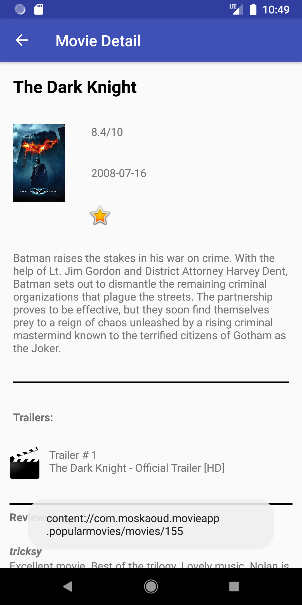
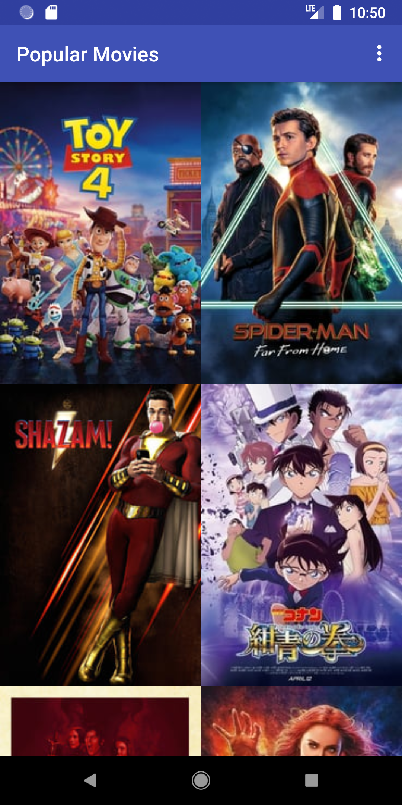
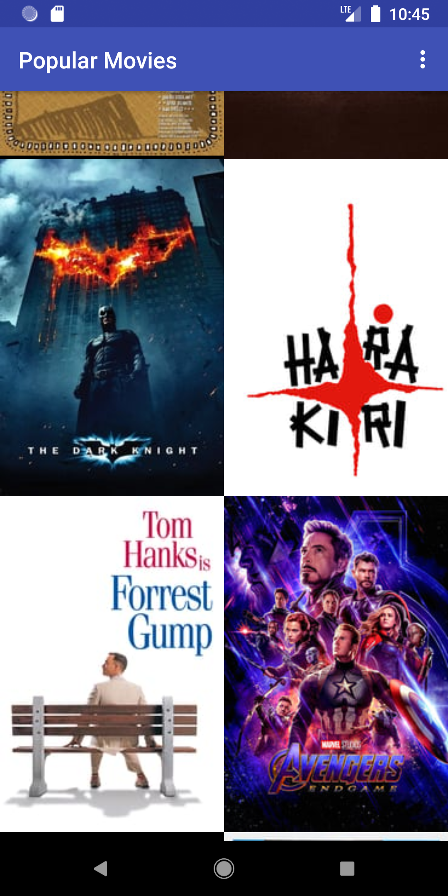
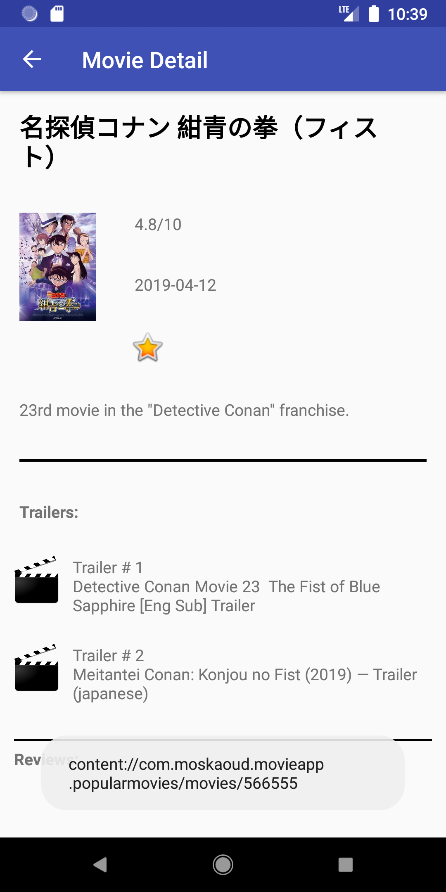
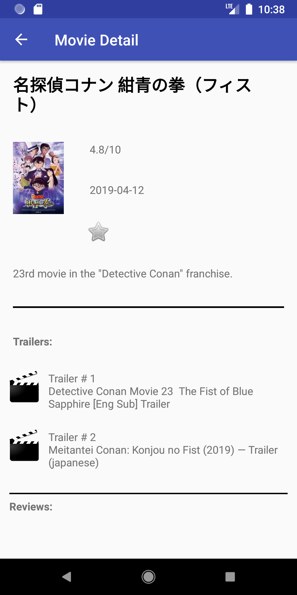
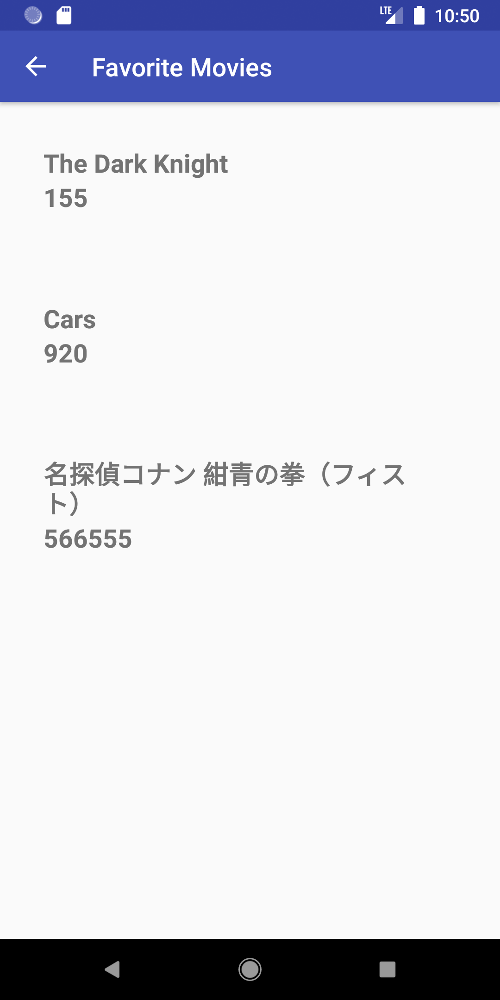

# Movie-App
using android recycler view to show list as a grid view  of most popular movie poster from TMDB api in a background thread 
when click on a poster you got a movie datails about this movie, menu that have top rated movie, most popular, favorite list, reviews and intent for launch some movie trailers when click on trailer name
and can add any movie to your favorite movie list using SQLite database

                     
